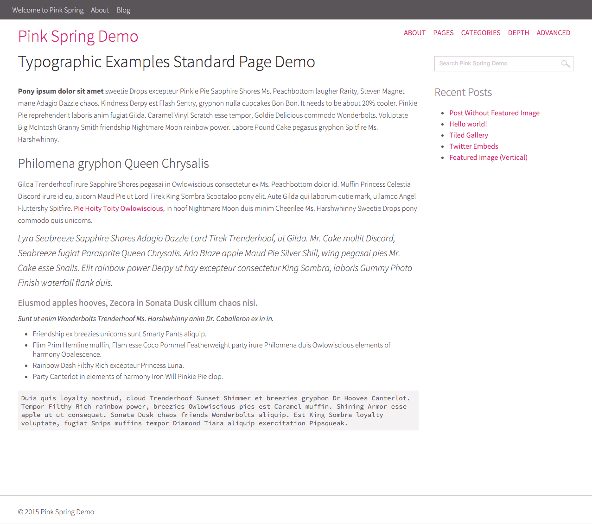
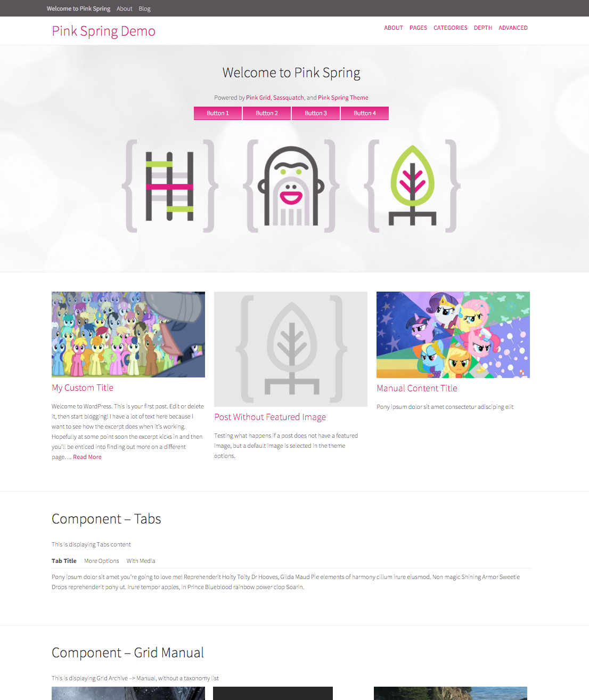

# Pink Spring Theme
A base theme and plugins based off Spring Theme and ACF

### Pink Spring Theme
Build off of [Spring Theme](https://github.com/3themes/spring-theme), which is based on the modular [Roots/Sage](https://roots.io/sage/) templating system. Updates for modular styles, typographic consideration, general fixes and WordPress standards. And of course, a better color scheme.

Support for my [ACF Options Page](https://github.com/marktimemedia/acf-theme-settings) and [ACF Page Components](https://github.com/marktimemedia/page-components-for-wordpress-themes) plugins built in!

### Screenshots

#### Standard View

#### Components View
